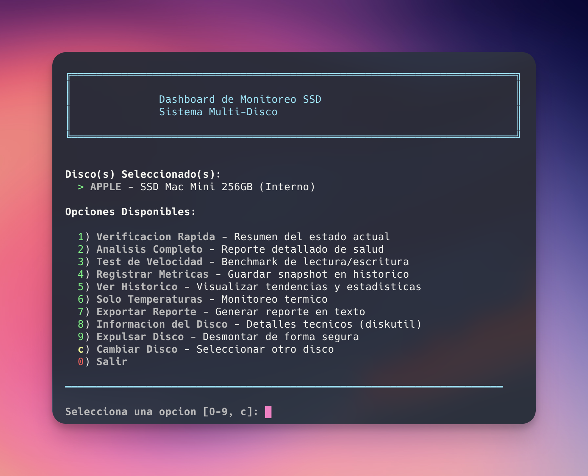
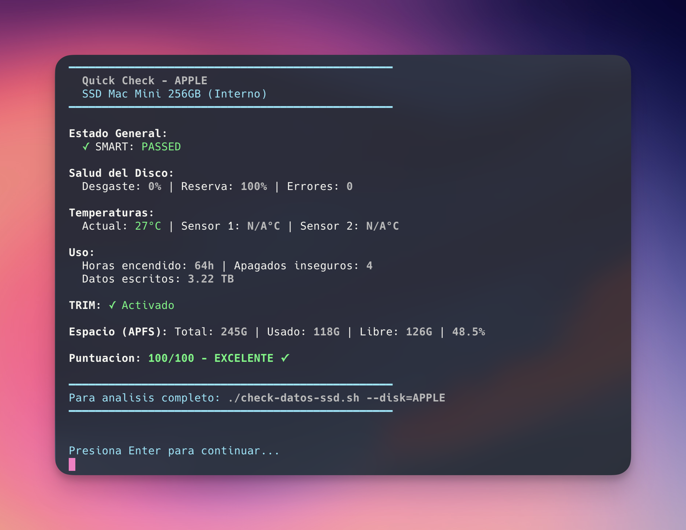
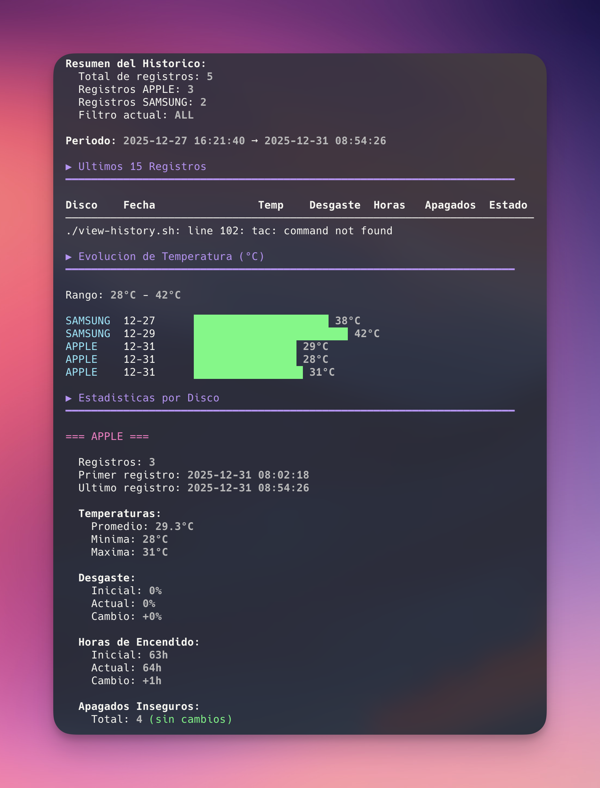

# macOS SSD Monitor


A comprehensive SSD health monitoring system for macOS with multi-disk support. Monitor your internal Apple SSD and external drives with an interactive dashboard, detailed SMART analysis, temperature tracking, and historical metrics.

## Features

- **Multi-Disk Support** - Monitor internal Apple SSDs and external drives simultaneously
- **Interactive Dashboard** - User-friendly menu-driven interface with color-coded output
- **SMART Analysis** - Complete SMART data reading including health status, wear level, and error counts
- **Temperature Monitoring** - Real-time temperature with multi-sensor support
- **Speed Testing** - Read/write performance benchmarks with cache bypass
- **Historical Tracking** - CSV-based metrics logging with trend visualization
- **Disconnect Monitor** - Real-time kernel event monitoring for external drives
- **Shell Aliases** - Quick access commands for common operations
- **Health Scoring** - Visual health assessment with color indicators

## Screenshots

### Main Dashboard

*Interactive dashboard on Mac Mini M4 with internal Apple SSD 256GB*

### Quick Check

*Fast health overview showing SMART status, temperature (27°C), TRIM status, APFS space, and health score (100/100)*

### Full Analysis

*Detailed SMART analysis including NVMe information, health status, and real-time temperature monitoring*

### Historical Metrics

*Historical tracking with temperature evolution graph and per-disk statistics*

## Requirements

- **macOS** Sonoma or later (tested on macOS 15.x)
- **Apple Silicon** Mac (M1, M2, M3, M4)
- **smartmontools** - For SMART data access

## Installation

### 1. Clone the repository

```bash
git clone https://github.com/yourusername/macos-ssd-monitor.git
cd macos-ssd-monitor
```

### 2. Run the installer

```bash
./install.sh
```

The installer will:
- Check and install `smartmontools` via Homebrew if needed
- Detect available disks
- Set execution permissions
- Create required directories
- Optionally configure shell aliases

### Manual Installation

If you prefer manual setup:

```bash
# Install smartmontools
brew install smartmontools

# Set permissions
chmod +x *.sh

# Create directories
mkdir -p logs reports

# Run the dashboard
./ssd-dashboard.sh
```

## Configuration

Edit `config.sh` to match your system's disks:

```bash
# Primary Disk (internal)
DISK_APPLE_DEVICE="disk0"           # Run 'diskutil list' to find yours
DISK_APPLE_NAME="APPLE"
DISK_APPLE_DESC="Internal Apple SSD"

# Secondary Disk (external)
DISK_SAMSUNG_DEVICE="disk4"         # External disk identifier
DISK_SAMSUNG_NAME="SAMSUNG"
DISK_SAMSUNG_DESC="External Samsung SSD"
DISK_SAMSUNG_VOLUME="/Volumes/ExternalSSD"  # Mount point
```

### Finding Your Disk Identifiers

```bash
# List all disks
diskutil list

# Verify SMART support
smartctl -a /dev/disk0
```

## Usage

### Interactive Dashboard (Recommended)

```bash
./ssd-dashboard.sh
# or with alias:
ssd
```

At startup, select which disk(s) to analyze:
1. **Primary** - Internal Apple SSD
2. **Secondary** - External drive
3. **Both** - Analyze both disks sequentially

### Command-Line Options

```bash
# Quick health check
./quick-check.sh --disk=apple

# Full analysis
./check-datos-ssd.sh --disk=samsung

# Full analysis with speed test
./check-datos-ssd.sh --disk=apple --speed-test

# View history
./view-history.sh --disk=all

# Record current metrics
./track-ssd-history.sh
```

### Available Aliases

After running `setup-aliases.sh`:

| Alias | Description |
|-------|-------------|
| `ssd` | Interactive dashboard |
| `ssd-quick` | Quick health check |
| `ssd-check` | Full analysis |
| `ssd-speed` | Analysis + speed test |
| `ssd-temp` | Temperature of all disks |
| `ssd-health` | SMART health status |
| `ssd-info` | Disk information |
| `ssd-eject` | Safely eject external disk |
| `ssd-history` | View metrics history |
| `ssd-track` | Record current metrics |

## Dashboard Menu Options

| Option | Description |
|--------|-------------|
| 1 | Quick Check - Fast health overview |
| 2 | Full Analysis - Detailed SMART report |
| 3 | Speed Test - Read/write benchmarks |
| 4 | View Temperatures - Current thermal status |
| 5 | View History - Historical metrics and trends |
| 6 | Record Metrics - Save current state to CSV |
| 7 | Export Report - Generate detailed text report |
| 8 | Disk Info - System and APFS details |
| 9 | Eject Disk - Safely unmount external drive |
| m | Monitor Disconnects - Kernel event watcher (external only) |
| 0 | Exit |

## Monitored Metrics

### SMART Data
- Overall health status (PASSED/FAILED)
- Critical warnings
- Available spare capacity
- Percentage used (wear level)
- Media and data integrity errors
- Error log entries

### Temperature
- Current temperature
- Sensor 1 & 2 readings (when available)
- Warning threshold indicators
- Time spent at critical temperatures

### Usage Statistics
- Power-on hours
- Power cycle count
- Unsafe shutdowns
- Data written (TB)
- Data read (TB)
- Host read/write commands

### File System
- APFS container information
- Total/used/available space
- TRIM support status

## File Structure

```
macos-ssd-monitor/
├── README.md              # This documentation
├── LICENSE                # MIT License
├── config.sh              # Disk configuration
├── install.sh             # Installation script
├── setup-aliases.sh       # Shell alias setup
├── ssd-dashboard.sh       # Main interactive dashboard
├── check-datos-ssd.sh     # Full analysis script
├── quick-check.sh         # Quick check script
├── track-ssd-history.sh   # Metrics recording
├── view-history.sh        # History visualization
├── logs/                  # Metrics CSV files (created on first run)
└── reports/               # Exported reports (created on first run)
```

## Historical Data

Metrics are stored in CSV format at `logs/ssd-history.csv`:

```csv
disk_name,timestamp,date,power_on_hours,power_cycles,unsafe_shutdowns,temperature,...
APPLE,1735689600,2025-01-01 12:00:00,1234,456,2,35,...
SAMSUNG,1735689650,2025-01-01 12:00:50,567,89,5,42,...
```

## Troubleshooting

### "smartctl not found"
```bash
brew install smartmontools
```

### "Permission denied" errors
```bash
chmod +x *.sh
```

### Disk not detected
1. Run `diskutil list` to find the correct disk identifier
2. Update `DISK_*_DEVICE` in `config.sh`
3. For external disks, ensure they're connected and mounted

### Speed test asks for password
The speed test uses `sudo purge` to clear disk cache. You can optionally add a sudoers rule:
```bash
echo "$USER ALL=(ALL) NOPASSWD: /usr/sbin/purge" | sudo tee /etc/sudoers.d/purge-nopasswd
```

### External disk shows wrong values
- Verify the volume mount point in `DISK_SAMSUNG_VOLUME`
- Check that TRIM is supported for external enclosures

## Technical Notes

### TRIM Detection
Uses `system_profiler SPNVMeDataType` with BSD Name filtering to accurately detect TRIM support per disk.

### APFS Space Calculation
For internal Apple SSDs, uses `diskutil apfs list` to get actual container usage, as `df /` only reports the sealed system volume.

### Terminal Reset
Uses `printf '\033c'` for complete terminal reset including scrollback buffer.

## Contributing

Contributions are welcome! Please feel free to submit a Pull Request.

1. Fork the repository
2. Create your feature branch (`git checkout -b feature/AmazingFeature`)
3. Commit your changes (`git commit -m 'Add some AmazingFeature'`)
4. Push to the branch (`git push origin feature/AmazingFeature`)
5. Open a Pull Request

## License

This project is licensed under the MIT License - see the [LICENSE](LICENSE) file for details.

## Acknowledgments

- [smartmontools](https://www.smartmontools.org/) for SMART data access
- Apple's `diskutil` for disk management utilities
